---
language:
  - rn
license: cc-by-4.0
task_categories:
  - automatic-speech-recognition
  - text-to-speech
  - translation
pretty_name: Kirundi Open Speech & Text Dataset
tags:
  - kirundi
  - low-resource
  - audio
  - speech
size_categories:
  - 1K<n<100K
---

<div align="center">

# 🇧🇮 Kirundi Open Speech & Text Dataset

[](https://opensource.org/licenses/MIT)
[](https://creativecommons.org/licenses/by/4.0/)
[](CONTRIBUTING.md)
[](https://github.com/Ijwi-ry-Ikirundi-AI/Kirundi_Dataset)

_Building the first large-scale, open-source speech and text dataset for Kirundi_

[🚀 Get Started](#-how-to-contribute) • [📊 Dataset](#-dataset-structure) • [🎯 Roadmap](#-project-roadmap) • [🫱🏿‍🫲🏾 Community](#-community)

</div>

---

## 🌍 About This Project

**Kirundi** is spoken by over 12 million people, yet it remains a **low-resource language** largely ignored by modern AI systems. We're changing that.

This community-driven initiative aims to create the **first comprehensive, open-source speech and text dataset** for Kirundi, enabling the development of:

### 🎯 Target Applications

| Application                 | Description                                   | Status         |
| --------------------------- | --------------------------------------------- | -------------- |
| 🎙️ **Speech-to-Text (ASR)** | Transcribe spoken Kirundi into text           | 🔄 In Progress |
| 🗣️ **Text-to-Speech (TTS)** | Generate natural-sounding Kirundi speech      | 📋 Planned     |
| 🌐 **Machine Translation**  | Translate between Kirundi and other languages | 📋 Planned     |
| 🎧 **Speech Translation**   | Direct speech-to-speech translation           | 📋 Planned     |

> **Our Mission**: _Ikirundi cacu, Ijwi ryacu_ - Preserve and digitize our language for future generations.

## 🚀 How to Contribute

This project has two "homes," so your contribution flow depends on _what_ you are adding:

- **For Text, Translations, or Code:** Use our [GitHub Repository](https://github.com/Ijwi-ry-Ikirundi-AI/Kirundi_Dataset).
- **For Audio:** You **must** use our [Hugging Face Repository](https://huggingface.co/datasets/Ijwi-ry-Ikirundi-AI/Kirundi_Open_Speech_Dataset).

<div align="center">

**Every contribution matters! Choose the option that works best for you:**

</div>

### 📝 Option 1: Add Kirundi Text (via GitHub)

<details>
<summary><b>🎯 Goal:</b> Collect clean, high-quality Kirundi sentences</summary>

1.  **Go to GitHub:** Fork and clone the [GitHub Repository](https://github.com/Ijwi-ry-Ikirundi-AI/Kirundi_Dataset).
2.  **Find & Clean Text:** Find new Kirundi sentences and clean them (remove `[edit]`, dates, etc.).
3.  **Add to File:** Add your clean sentences (one per line) to the `kirundi_prompts_scraped.txt` file.
4.  **Run Appender:** Run the `python scripts/append_to_csv.py` script to add your new sentences to `metadata.csv` and avoid duplicates.
5.  **Submit PR:** Push your changes to your fork and submit a **Pull Request on GitHub**.

</details>

---

### 🌐 Option 2: Add French Translations (via GitHub)

<details>
<summary><b>🎯 Goal:</b> Provide high-quality Kirundi ↔ French translations</summary>

1.  **Go to GitHub:** Fork and clone the [GitHub Repository](https://github.com/Ijwi-ry-Ikirundi-AI/Kirundi_Dataset).
2.  **Find Rows:** Open `metadata.csv` and find rows with an empty `french_translation` column.
3.  **Translate:** Add your high-quality, natural translation.
4.  **Submit PR:** Push your changes to your fork and submit a **Pull Request on GitHub**.

</details>

---

### 🎤 Option 3: Record Audio (via Hugging Face - CRITICAL!)

<details>
<summary><b>🎯 Goal:</b> Create high-quality Kirundi speech recordings</summary>

**This is the most important step and MUST be done on Hugging Face.**

#### 📋 Step 0: First-Time Setup

1.  **Go to Hugging Face:** Fork the [Hugging Face Dataset](https://huggingface.co/datasets/Ijwi-ry-Ikirundi-AI/Kirundi_Open_Speech_Dataset).
2.  **Clone Your Fork:**
    ```bash
    # Clone your fork from Hugging Face (replace "Your-HF-Username")
    git clone https://huggingface.co/datasets/Your-HF-Username/Kirundi_Open_Speech_Dataset
    cd Kirundi_Open_Speech_Dataset
    ```
3.  **Install Git LFS:**
    ```bash
    git lfs install
    ```
    _(This is a one-time setup on your computer. You can download Git LFS from [git-lfs.github.com](https://git-lfs.github.com/))_

#### 📋 Step 1: Record & Update

1.  **Find a Task:** Open `metadata.csv` and find a row with an empty `file_path`.
2.  **Record:** Record the audio for that `kirundi_transcription` following our [Recording Guidelines](#-recording-guidelines).
3.  **Save:** Save your audio file (e.g., `rn_0001.wav`) into the `clips/` folder.
4.  **Update CSV:** Fill in your row in `metadata.csv` (add the `file_path`, your `speaker_id`, `age`, and `gender`).

#### 📋 Step 2: Submit

1.  **Push to Hugging Face:**
    ```bash
    git add .
    git commit -m "Added new audio clip clips/rn_0001.wav"
    git push
    ```
    Git LFS will automatically upload your audio to Hugging Face LFS storage.
2.  **Submit PR:** Go to your Hugging Face fork and submit a **Pull Request on Hugging Face**.

</details>

## 🎧 Recording Guidelines

<div align="center">

**📏 Quality Standards for Audio Recordings**

</div>

### 🎯 Recording Best Practices

| Aspect                | Requirement                                | Why It Matters                 |
| --------------------- | ------------------------------------------ | ------------------------------ |
| 🔇 **Environment**    | Quiet room, no background noise            | Ensures clean training data    |
| 🎙️ **Microphone**     | Headset mic or smartphone (close to mouth) | Clear audio capture            |
| 🗣️ **Speaking Style** | Natural, clear pronunciation               | Realistic speech patterns      |
| 📝 **Accuracy**       | Read exactly as written                    | Maintains text-audio alignment |

### ⚙️ Technical Specifications

```yaml
Audio Format:
  - Primary: WAV (uncompressed)
  - Alternative: MP3 (high quality)

Settings:
  - Sample Rate: 16kHz or 22.05kHz
  - Channels: Mono (1 channel)
  - Bit Depth: 16-bit
  - Duration: Natural sentence length
```

### 🛠️ Recommended Tools

- **🎵 [Audacity](https://www.audacityteam.org/)** (Free, cross-platform)
- **📱 ASR Voice Recorder** (Android app - excellent for high-quality recordings)
- **📱 Smartphone voice recorder** (built-in apps work great)
- **💻 Online recorders** (for quick contributions)

---

## 🔄 Pushing to Both Repositories (For Maintainers)

<div align="center">

**🎯 How to Sync Changes Across GitHub and Hugging Face**

</div>

If you're a maintainer who needs to push changes to both repositories, you can set up multiple remotes:

### 📋 One-Time Setup

```bash
# Add Hugging Face as a remote (if not already added)
git remote add hf https://huggingface.co/datasets/Ijwi-ry-Ikirundi-AI/Kirundi_Open_Speech_Dataset

# Add GitHub as a remote (if not already added)
git remote add origin https://github.com/Ijwi-ry-Ikirundi-AI/Kirundi_Dataset

# Verify your remotes
git remote -v
```

### 📤 Pushing Changes to Both Platforms

```bash
# 1. Add your changes
git add .

# 2. Commit your changes
git commit -m "Your commit message here"

# 3. Push to Hugging Face
git push hf main

# 4. Push to GitHub
git push origin main
```

### 🔧 Example: Fixing .gitignore for LFS

```bash
# 1. Add the change you just made
git add .gitignore

# 2. Commit the fix
git commit -m "Fix: Removed audio files from .gitignore to allow LFS tracking"

# 3. Push the fix to Hugging Face
git push hf main

# 4. Push the fix to GitHub
git push origin main
```

> **💡 Tip**: You can also push to both remotes in one command:
>
> ```bash
> git push hf main && git push origin main
> ```

---

## 📊 Dataset Structure

Our dataset is organized around `metadata.csv` - the central hub for all project data.

### 📋 Schema Overview

| Column                  | Type   | Description                      | Example                             |
| ----------------------- | ------ | -------------------------------- | ----------------------------------- |
| `file_path`             | String | Relative path to audio file      | `clips/rn_0001.wav`                 |
| `kirundi_transcription` | String | Exact Kirundi sentence           | `Amahoro y'Imana abane nawe`        |
| `french_translation`    | String | High-quality French translation  | `Que la paix de Dieu soit avec toi` |
| `English_Translation`   | String | High-quality English translation | `May the peace of God be with you`  |
| `Domain`                | String | Topic or category                | `General`, `News`, `Religion`       |
| `speaker_id`            | String | Anonymous speaker identifier     | `speaker_001`                       |
| `age`                   | String | Age group                        | `20s`, `30s`, `40s+`                |
| `gender`                | String | Self-identified gender           | `male`, `female`, `other`           |
| `Machine_Suggestion`    | String | AI generated suggestion          | `Les enfants jouent dehors.`        |

### 📁 Directory Structure

```
Kirundi_Dataset/
├── 📄 README.md              # This file
├── 📊 metadata.csv           # Master dataset file
├── 🎵 clips/                 # Audio recordings
│   ├── rn_0001.wav
│   ├── rn_0002.wav
│   └── ...
└── 🔧 scripts/               # Automation tools
    ├── append_to_csv.py      # Add new sentences
    ├── scrapping_kirundi_words.py  # Web scraping
    └── kirundi_prompts_scraped.txt # Raw text input
```

## 🎯 Project Roadmap

<div align="center">

**🚀 Building the Future of Kirundi AI, One Step at a Time**

</div>

### 📈 Development Phases

```mermaid
graph LR
    A[📝 Text Collection] --> B[🌐 Translation]
    B --> C[🎤 Audio Recording]
    C --> D[🤖 Model Training]
    D --> E[🚀 Deployment]
```



| Phase       | Goal                  | Target             | Status             | Progress                                 |
| ----------- | --------------------- | ------------------ | ------------------ | ---------------------------------------- |
| **Phase 1** | 📠Text Collection    | 10,000+ sentences  | 🔄 **In Progress** |  |
| **Phase 2** | 🌠French Translation | Complete dataset   | 📋 Planned         |  |
| **Phase 3** | 🤠Audio Recording    | 20+ hours          | 📋 Planned         |  |
| **Phase 4** | 🤖 Model Training     | ASR/TTS/MT models  | 📋 Planned         |  |
| **Phase 5** | 🚀 Public Release     | Open-source models | 🯠Future          |  |

### 🎯 Current Milestones

- ✅ **Repository Setup**: Project structure and automation scripts
- ✅ **Data Pipeline**: Automated text processing and validation
- 🔄 **Community Building**: Growing contributor base
- 📋 **Quality Standards**: Establishing recording and translation guidelines

---

## 🫱🏿‍🫲🏾 Community

<div align="center">

**Join our mission to preserve and digitize Kirundi!**

[](https://discord.gg/your-server)
[](https://t.me/your-group)
[](https://chat.whatsapp.com/your-group)

</div>

### 🌟 Contributors

We thank all our amazing contributors who are helping build this dataset:

#### 💻 Code Contributors

<a href="https://github.com/Ijwi-ry-Ikirundi-AI/Kirundi_Dataset/graphs/contributors">
  
</a>

#### 📄 Dataset & Documentation Contributors

<a href="https://github.com/lionel-k">
  
</a>

### 📊 Current Stats

| Metric                  | Count |
| ----------------------- | ----- |
| 📝 **Total Sentences**  | 3062  |
| 🎤 **Audio Recordings** | 1     |
| 🌐 **Translations**     | 2000  |
| 👥 **Contributors**     | 3     |

---

## ⚖️ License

<div align="center">

| Component             | License                                                                                                                        | Details                             |
| --------------------- | ------------------------------------------------------------------------------------------------------------------------------ | ----------------------------------- |
| 🔧 **Code & Scripts** | [](https://opensource.org/licenses/MIT)                     | Free to use, modify, and distribute |
| 📊 **Dataset**        | [](https://creativecommons.org/licenses/by/4.0/) | Open access with attribution        |

</div>

### 📜 What This Means

- ✅ **Free to use** for research, commercial, and educational purposes
- ✅ **Attribution required** when using the dataset
- ✅ **No restrictions** on derivative works
- ✅ **Open source** forever

---

<div align="center">

## 💝 Support This Project

**🇧🇮 _Ikirundi cacu, Ijwi ryacu_ 🇧🇮**

_Our language, our voice - Thank you for helping build the future of Kirundi AI_

---

**⭐ Star this repository** • **🔄 Share with friends** • **🫱🏿‍🫲🏾Contribute today**

[](https://github.com/Sama-ndari/Kirundi_Dataset)
[](https://github.com/Sama-ndari)

</div>
